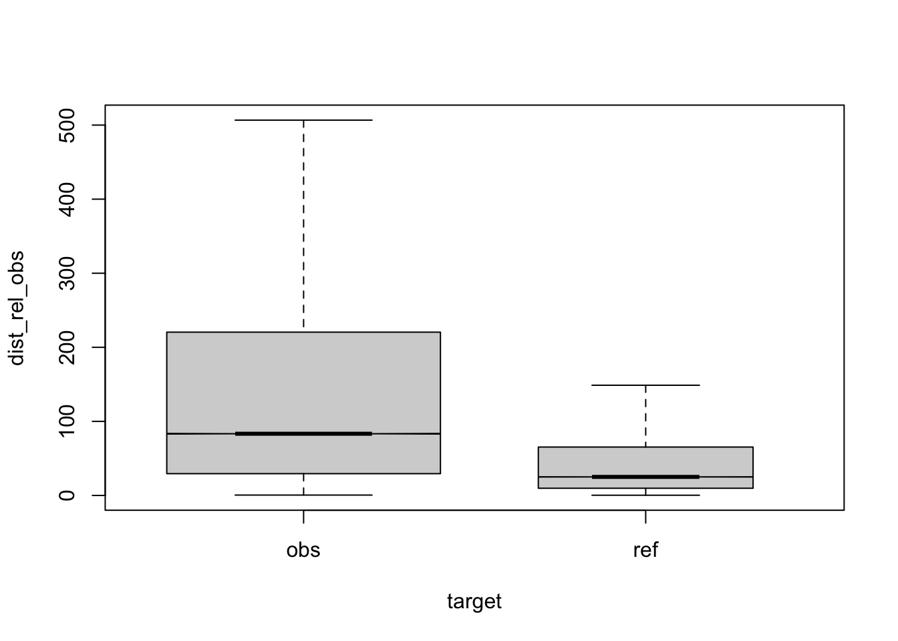
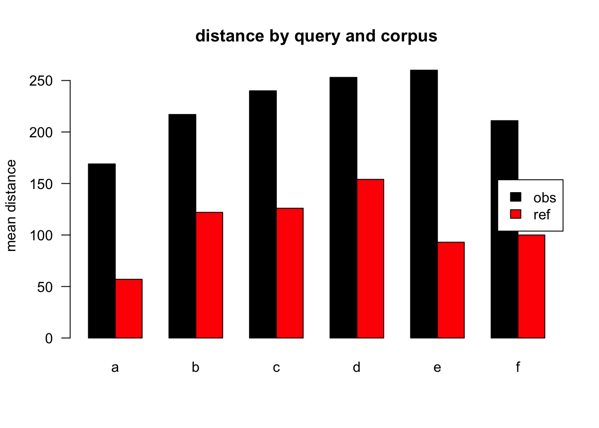
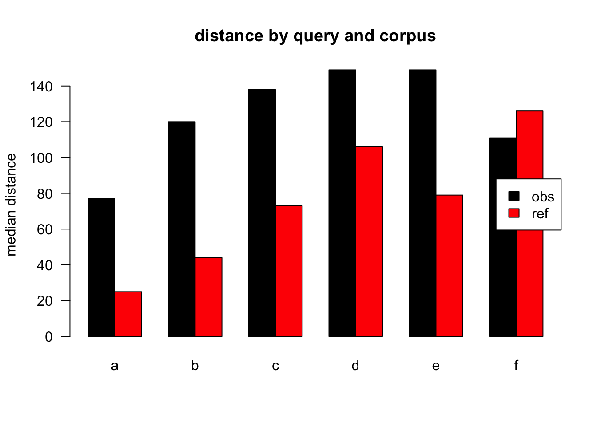
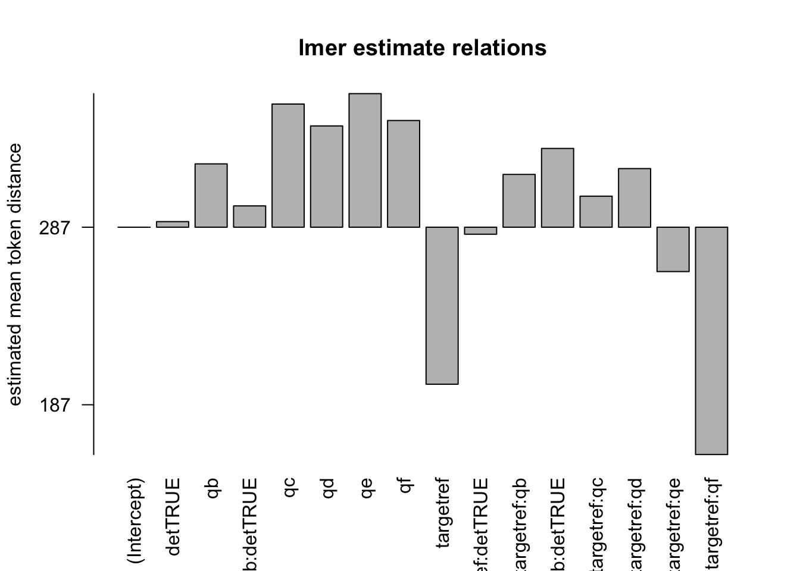
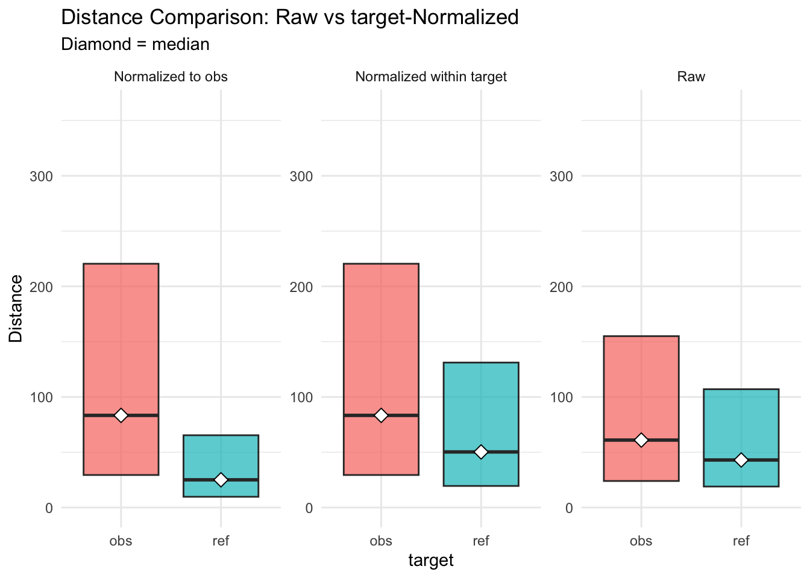

<style type="text/css">
/*table {
  width: 100% !important;
  
}*/
pre {
border: 1px solid black;
border-radius: 0.25rem;
background-color: rgba(0, 0, 0, 0.04);

}
</style>


# top
eval output M11, normalised to obs, distance ceiling =  outliers removed.

## legende

``` r
legend<-data.frame(variable=c("target","q","det",paste0("q:",letters[1:6])),
                   explanation=c("corpus","condition","antecedent POS==DET",rep("query condition",6)),
                   values=c("obs,ref","a,b,c,d,e,f","TRUE,FALSE",
                            ".*","this,that,those,these","the","a,an,any,some","my","his,her,their,your")
                   )
#library(kableExtra)

# k<-kable(legend,caption = "model vars")
# k<-kable_styling(k,full_width = TRUE)
# k
kable(legend, caption = "model vars",format="markdown")
```

## anova analysis
### anova plain, formula: [``` dist_rel_obs ~ target*q*det ```]


### anova of linear regression model: [`anova(summary(lmer))`]


### linear regression coefficients, formula: [``` dist_rel_obs ~ target*q*det+(1|lemma)+(1|aut_id) ```]


## plots
<div class="figure">

<p class="caption">(\#fig:boxplot1)compare distances by corpus, normalised to obs, distance ceiling =  outliers removed</p>
</div>

<div class="figure">

<p class="caption">(\#fig:barplot-median)mean distances over query/corpus, normalised to obs, distance ceiling =  outliers removed</p>
</div>


<div class="figure">

<p class="caption">(\#fig:barplot-mean)median distances over query/corpus, normalised to obs, distance ceiling =  outliers removed</p>
</div>

<div class="figure">

<p class="caption">(\#fig:lmeplot)distances relation, normalised to obs, distance ceiling =  outliers removed</p>
</div>

<div class="figure">

<p class="caption">(\#fig:gplot)distances normalised vs. raw</p>
</div>
-----

# REF
literature used and alii...   


