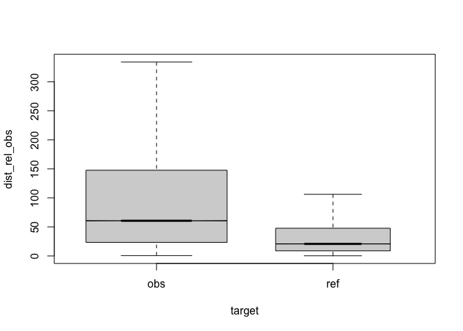
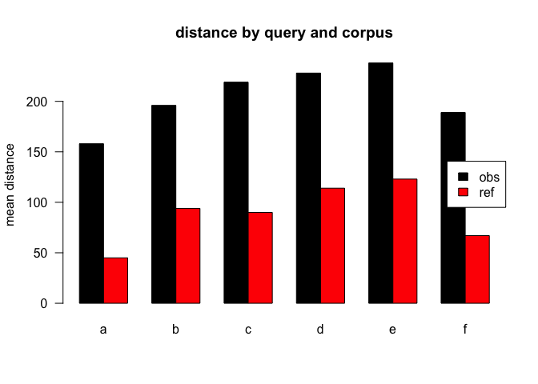
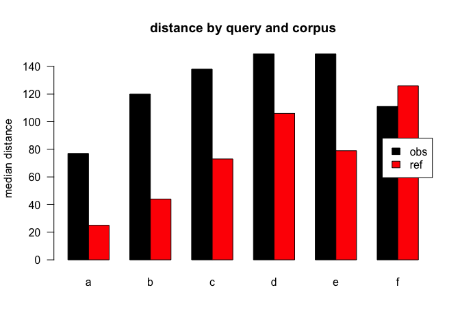
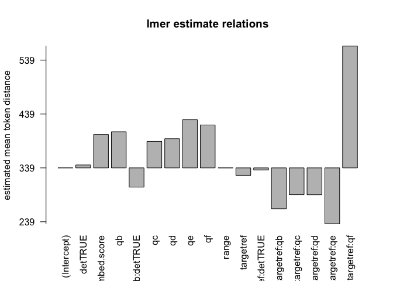
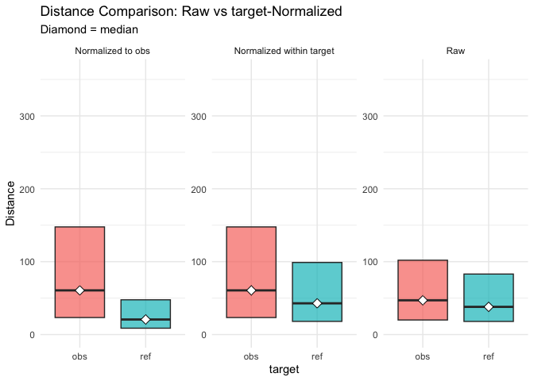

+++
title = "xtitle - coherence & presuppositions observations in schizophrenia threads"
[extra]
authors = [{name="st. schwarz"},]
date = "2025-07-26"
buttons = [
    {name = "Paper", url = "https://aterenin.github.io/academic-paper"},
    {name = "PDF", url = "https://github.com/esteeschwarz/SPUND-LX/tree/main/psych/poster/eval-007.pdf"},
    {name = "Code", url = "https://github.com/esteeschwarz/SPUND-LX/tree/main/psych"},
    {name = "Poster", url = "https://github.com/esteeschwarz/SPUND-LX/tree/main/psych/poster/eval-007.pdf"},
]
venue = {name = "GitHub", url = "https://github.com/esteeschwarz/SPUND-LX/tree/main/psych"}

+++

# top

eval output M11, normalised to obs, distance ceiling = outliers removed.

## legende

| variable | explanation         | values                |
|:---------|:--------------------|:----------------------|
| target   | corpus              | obs,ref               |
| q        | condition           | a,b,c,d,e,f           |
| det      | antecedent POS==DET | TRUE,FALSE            |
| q:a      | query condition     | .\*                   |
| q:b      | query condition     | this,that,those,these |
| q:c      | query condition     | the                   |
| q:d      | query condition     | a,an,any,some         |
| q:e      | query condition     | my                    |
| q:f      | query condition     | his,her,their,your    |

model vars

## anova analysis

### anova plain, formula: \[`dist_rel_obs ~ target*q*det`\]

    ##                   Df     Sum Sq    Mean Sq    F value    Pr(>F)    
    ## target             1 3.6884e+09 3688441713 86368.2495 < 2.2e-16 ***
    ## q                  5 4.5563e+08   91126214  2133.8040 < 2.2e-16 ***
    ## det                1 2.8130e+07   28129559   658.6794 < 2.2e-16 ***
    ## target:q           5 2.6402e+06     528048    12.3647 5.105e-12 ***
    ## target:det         1 2.3260e+06    2325954    54.4643 1.584e-13 ***
    ## q:det              1 2.7700e+06    2769968    64.8613 8.044e-16 ***
    ## target:q:det       1 4.3320e+03       4332     0.1014    0.7501    
    ## Residuals    1045139 4.4634e+10      42706                         
    ## ---
    ## Signif. codes:  0 '***' 0.001 '**' 0.01 '*' 0.05 '.' 0.1 ' ' 1

### anova of linear regression model: \[`anova(summary(lmer))`\]

    ## Type III Analysis of Variance Table with Satterthwaite's method
    ##                Sum Sq Mean Sq NumDF   DenDF  F value    Pr(>F)    
    ## target        6094426 6094426     1  718328 185.7599 < 2.2e-16 ***
    ## q            42974986 8594997     5 1037780 261.9780 < 2.2e-16 ***
    ## det            372221  372221     1 1037864  11.3454 0.0007564 ***
    ## target:q      1766151  353230     5 1037779  10.7666  2.27e-10 ***
    ## target:det      92612   92612     1 1037867   2.8228 0.0929316 .  
    ## q:det          326995  326995     1 1037796   9.9669 0.0015938 ** 
    ## target:q:det   137650  137650     1 1037795   4.1956 0.0405288 *  
    ## ---
    ## Signif. codes:  0 '***' 0.001 '**' 0.01 '*' 0.05 '.' 0.1 ' ' 1

### linear regression coefficients, formula: \[`dist_rel_obs ~ target*q*det+(1|lemma)+(1|aut_id)`\]

    ## Linear mixed model fit by REML. t-tests use Satterthwaite's method ['lmerModLmerTest']
    ## Formula: eval(expr(lmeform))
    ##    Data: dfa
    ## 
    ## REML criterion at convergence: 13864438
    ## 
    ## Scaled residuals: 
    ##     Min      1Q  Median      3Q     Max 
    ## -6.3215 -0.4316 -0.0874  0.1283 12.4351 
    ## 
    ## Random effects:
    ##  Groups   Name        Variance Std.Dev.
    ##  aut_id   (Intercept) 40316    200.8   
    ##  lemma    (Intercept) 42511    206.2   
    ##  Residual             32808    181.1   
    ## Number of obs: 1045155, groups:  aut_id, 4533; lemma, 3652
    ## 
    ## Fixed effects:
    ##                        Estimate Std. Error         df t value Pr(>|t|)    
    ## (Intercept)           2.870e+02  4.900e+00  6.838e+03  58.565  < 2e-16 ***
    ## targetref            -8.842e+01  3.051e+00  7.021e+04 -28.978  < 2e-16 ***
    ## qb                    3.566e+01  7.380e+00  1.036e+06   4.833 1.35e-06 ***
    ## qc                    6.937e+01  1.268e+00  1.038e+06  54.728  < 2e-16 ***
    ## qd                    5.704e+01  1.325e+00  1.038e+06  43.053  < 2e-16 ***
    ## qe                    7.522e+01  1.447e+00  1.038e+06  51.975  < 2e-16 ***
    ## qf                    6.010e+01  1.805e+00  1.037e+06  33.291  < 2e-16 ***
    ## detTRUE               3.154e+00  6.295e-01  1.042e+06   5.011 5.42e-07 ***
    ## targetref:qb          2.973e+01  1.105e+01  1.038e+06   2.690 0.007140 ** 
    ## targetref:qc          1.748e+01  6.460e+00  1.038e+06   2.706 0.006813 ** 
    ## targetref:qd          3.302e+01  6.156e+00  1.037e+06   5.363 8.18e-08 ***
    ## targetref:qe         -2.499e+01  8.090e+00  1.038e+06  -3.090 0.002005 ** 
    ## targetref:qf         -1.280e+02  3.760e+01  1.038e+06  -3.404 0.000663 ***
    ## targetref:detTRUE    -3.951e+00  1.561e+00  1.043e+06  -2.531 0.011370 *  
    ## qb:detTRUE            1.201e+01  7.839e+00  1.036e+06   1.532 0.125614    
    ## targetref:qb:detTRUE  4.436e+01  2.166e+01  1.038e+06   2.048 0.040529 *  
    ## ---
    ## Signif. codes:  0 '***' 0.001 '**' 0.01 '*' 0.05 '.' 0.1 ' ' 1
    ## fit warnings:
    ## fixed-effect model matrix is rank deficient so dropping 8 columns / coefficients

## plots

<figure>

<figcaption aria-hidden="true">compare distances by corpus, normalised to obs, distance ceiling = outliers removed</figcaption>
</figure>

<figure>

<figcaption aria-hidden="true">mean distances over query/corpus, normalised to obs, distance ceiling = outliers removed</figcaption>
</figure>

| target | q   |      n | mean | median |
|:-------|:----|-------:|-----:|-------:|
| obs    | a   | 557479 |  169 |     77 |
| ref    | a   | 394838 |   57 |     25 |
| obs    | b   |   5904 |  217 |    120 |
| ref    | b   |    747 |  122 |     44 |
| obs    | c   |  26883 |  240 |    138 |
| ref    | c   |   1033 |  126 |     73 |
| obs    | d   |  25400 |  253 |    149 |
| ref    | d   |   1041 |  154 |    106 |
| obs    | e   |  19228 |  260 |    149 |
| ref    | e   |    656 |   93 |     79 |
| obs    | f   |  11920 |  211 |    111 |
| ref    | f   |     26 |  100 |    126 |

<figure>

<figcaption aria-hidden="true">median distances over query/corpus, normalised to obs, distance ceiling = outliers removed</figcaption>
</figure>

<figure>

<figcaption aria-hidden="true">distances relation, normalised to obs, distance ceiling = outliers removed</figcaption>
</figure>

## 

# REF

literature used and alii…

Bates, Douglas, Martin Mächler, Ben Bolker, and Steve Walker. 2015. “Fitting Linear Mixed-Effects Models Using Lme4.” *Journal of Statistical Software* 67 (1): 1–48. <https://doi.org/10.18637/jss.v067.i01>.

De Marneffe, Marie-Catherine, Christopher D. Manning, Joakim Nivre, and Daniel Zeman. 2021. “Universal Dependencies.” *Computational Linguistics*, May, 1–54. <https://doi.org/10.1162/coli_a_00402>.

Prince, Ellen F. 1981. “Toward a Taxonomy of Given-New Information.” In *Syntax and Semantics: Vol. 14. Radical Pragmatics*, edited by P. Cole, 223–55. New York: Academic Press.

Rivera, Ivan. 2023. “RedditExtractoR: Reddit Data Extraction Toolkit.” <https://CRAN.R-project.org/package=RedditExtractoR>.

Schwarz, St. 2025. “Poster Appendix: This Papers Scripts for Corpus Build and Statistics on Github.” <https://github.com/esteeschwarz/SPUND-LX/tree/main/psych/HA>.

Wijffels, Jan. 2023. *Udpipe: Tokenization, Parts of Speech Tagging, Lemmatization and Dependency Parsing with the ’UDPipe’ ’NLP’ Toolkit*. <https://CRAN.R-project.org/package=udpipe>.

Zimmerer, Vitor C., Stuart Watson, Douglas Turkington, I. Nicol Ferrier, and Wolfram Hinzen. 2017. “Deictic and Propositional Meaning—New Perspectives on Language in Schizophrenia.” *Frontiers in Psychiatry* 8 (February). <https://doi.org/10.3389/fpsyt.2017.00017>.
