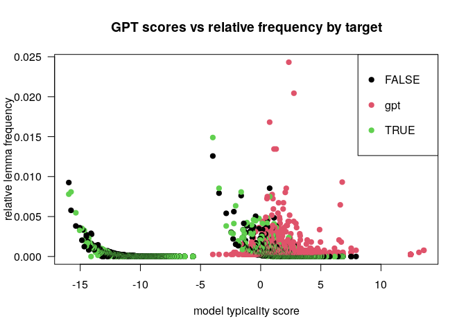
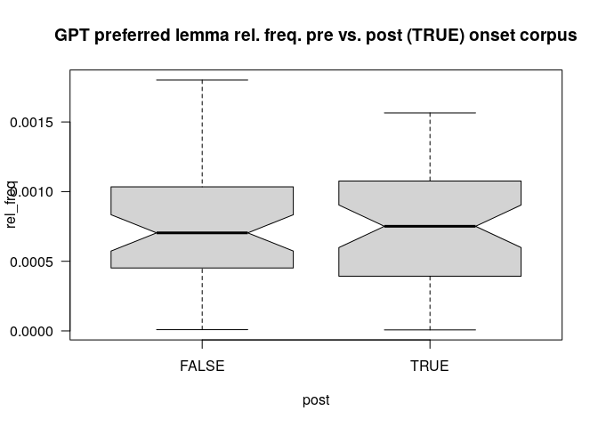
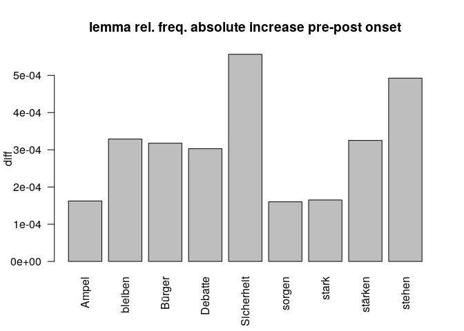

# gemini paper

2026-04-03

# index

## snc

- 16144.1.pdf
- wks. no fro q.yml
- no.

### 16145.

- from parent qyml

# the einleitung

inspired by the paper *Empirical evidence of Large Language Model’s
influence on human spoken communication*, Yakura et al. (2025), who
indeed found (evidence) for GPT influenced human language after the
introduction of chatGPT we tried to replicate the pipeline of building
an AI vocabulary (gpt preferred lemmata) and compare frequencies of
gpt-typical words across pre- and post chatGPT human language corpora.
The first draft essai proves their hypothesis that LLM generated
language manifests within human natural language.

the embedding of that investigation into the context of the class
subject *germanische sprachen im vergleich* is still due; first idea is
the projection of the Yakura et al. (2025) findings onto a german
language corpus and see if these are still valid although that may
rather be a pragmatics investigation.

## preliminary

Our findings are still limited to a yet very small corpus of texts after
the introduction of the google gemini chat agent to the german public in
03/2024, cf. Wikipedia and Google (2026). In contrast to Yakura et al.
(2025) and out of resources considerations we decided for gemini as
basis for our AI generated vocabulary and for another text corpus
(german bundestag plenary protocols, DIP (2026)) than youtube/podcast
audio for the same reasons. That limits our post-AI corpus to a small
timeframe between 03/2024 up to now. With expanding that corpus to a
wider spectrum with including other sources we may harden our results.

# hypothesis

following Yakura et al. (2025) we assumed that the consuming of LLM
generated language influences the human production of language such that
vocabulary typical for LLM output will be found with higher frequencies
in human language corpora dating after chat agent introduction.

# methods

## snc

16062.1.2.16063.1

please cf. Schwarz (2026) for the corpus building and evaluation script
(still messy.)

## data

our human langugae data consists of raw texts from german bundestag
plenary protocols (DIP (2026)). the LLM corpus consists of model
summaries of a first subset of these texts generated with the following
prompt:
<a href="#sec-gemini-prompt" class="quarto-xref">Section 4.2.2</a>.

### corpus subsets

| target     |  tokens |
|:-----------|--------:|
| gemini     |    3866 |
| human-pre  | 1640446 |
| human-post | 1940385 |

### gemini prompt

    [1] "System prompt: "                                                                                                                                                                                                                                                                                                                                                                                                                                                                                                                                                                           
    [2] "You are a member of german parliament. Prepare a summary of the text provided to present at a local community meeting of your party members. Output in german language, no preamble, no extra information, just the plain text. Wordcount maximal 300 words, containing not more than 5% of the keywords of the text provided and explicitly not just a list of keywords but an entertaining text. You are supposed to interprete freely, including background insights on daily politics. Keep in mind thatthe text will be used as is as keynotes to the talk being held to the locals. "
    [3] "Text:"                                                                                                                                                                                                                                                                                                                                                                                                                                                                                                                                                                                     

## computation

we first devised AI-typical lemmata in the model corpus which are
distinct for that corpus by log frequency calculation, see
<a href="#fig-gpt.dplot" class="quarto-xref">Figure 1</a>

Figure 1: lemma gpt scores over targets

# evaluation

## basic descriptive

to first gather an insight, yet with simple descriptive stats comparing
the raw frequencies of gpt-preferred lemmas in pre- and post-gemini
onset we find that in the target corpus the occurences of these lemma
increase, only by small amount (see
<a href="#tbl-s.df" class="quarto-xref">Table 1</a>) and hard to
visualise (see
<a href="#fig-boxplot01" class="quarto-xref">Figure 2</a>). wether these
findings become relevant, we’ll see in
<a href="#sec-lm-1" class="quarto-xref">Section 5.3</a> where we
evaluate the frequencies with a linear regression model.

Table 1: GPT lemma frequencies (table) over target. (freq / vH)

| target |   freq |
|:-------|-------:|
| pre    | 0.4384 |
| post   | 0.4414 |
| DIFF:  | 0.0030 |

Figure 2: GPT lemma frequencies (boxplot) over target. (freq / vH)

## responsible lemmata

The 9 lemma where 1. the relative frequency of lemma in target=post is
higher than in target=pre (n=27) and 2. that frequency exceeds the mean
relative frequency is displayed in
<a href="#fig-barplot" class="quarto-xref">Figure 3</a>.

Figure 3: lemma frequency increase of relevant AI typical lemma

### lemma descriptive output

### lemma linear model output

## linear regression

to prove descriptive results, we compute the stability of the frequency
increase for target- vs. reference corpus with a linear regression model
using R’s lme4::lmer() function, cf. Bates et al. (2015). coefficents
are printed below, where `freq_pmw` is the lemma frequencies/pmw over
corpus; `post` defines reference resp. target corpus
\[post==TRUE\|FALSE\] (pre/post) and gp as numerical variable
representing the gpt-score of the corresponding lemma i.e. wether it
scores high (positive values) or low (negative values) in terms of being
preferredly used by the chat agent.

### basic (lm)

formula: `frequency.pmw ~ post + gpt.score`

    Call:
    lm(formula = freq_pmw ~ post + gp, data = df_lg.norm)

    Residuals:
       Min     1Q Median     3Q    Max 
     -1400   -435   -388   -243 436922 

    Coefficients:
                Estimate Std. Error t value Pr(>|t|)    
    (Intercept)   833.75      38.64  21.576  < 2e-16 ***
    postTRUE       83.94      20.64   4.067 4.77e-05 ***
    gp             68.11       5.20  13.097  < 2e-16 ***
    ---
    Signif. codes:  0 '***' 0.001 '**' 0.01 '*' 0.05 '.' 0.1 ' ' 1

    Residual standard error: 3765 on 133087 degrees of freedom
      (1393 observations deleted due to missingness)
    Multiple R-squared:  0.0014,    Adjusted R-squared:  0.001385 
    F-statistic: 93.32 on 2 and 133087 DF,  p-value: < 2.2e-16

### random effects model (lmer)

formula: `frequency.pmw ~ post + gpt.score + (1|lemma)`

    Linear mixed model fit by REML. t-tests use Satterthwaite's method [
    lmerModLmerTest]
    Formula: freq_pmw ~ post + gp + (1 | lemma)
       Data: df_lg.norm

    REML criterion at convergence: 2490672

    Scaled residuals: 
        Min      1Q  Median      3Q     Max 
    -48.624  -0.047  -0.032   0.008  74.360 

    Random effects:
     Groups   Name        Variance Std.Dev.
     lemma    (Intercept) 8839356  2973    
     Residual             1754704  1325    
    Number of obs: 133090, groups:  lemma, 99649

    Fixed effects:
                 Estimate Std. Error        df t value Pr(>|t|)    
    (Intercept) 4.344e+02  3.966e+01 1.055e+05  10.953   <2e-16 ***
    postTRUE    1.246e+02  9.496e+00 5.602e+04  13.126   <2e-16 ***
    gp          2.932e+01  5.723e+00 1.017e+05   5.124    3e-07 ***
    ---
    Signif. codes:  0 '***' 0.001 '**' 0.01 '*' 0.05 '.' 0.1 ' ' 1

    Correlation of Fixed Effects:
             (Intr) psTRUE
    postTRUE -0.110       
    gp        0.959  0.009

    3 x 3 Matrix of class "corMatrix"
                (Intercept)     postTRUE          gp
    (Intercept)   1.0000000 -0.110159806 0.959345449
    postTRUE     -0.1101598  1.000000000 0.008711618
    gp            0.9593454  0.008711618 1.000000000

#### helper interpretation, to be tested

the coefficients interesting for us are the gp and post estimates. here
we test the association between the gpt score of a lemma and its
estimated frequency and its showing that a general increase of frequency
is estimated if the score rises (=the lemma is within the lemmas
preferred used by gemini) and that for the post-gpt corpus this increase
(`6.75072%`) is significant for single lemmata (and not random in data).

in the fixed effects correlation output of the lmer() model we see that
the gpt score correlates with the target corpus frequency for lemma by
`1`.

### anova of mixed effects model \[out\]

# references

Bates, Douglas, Martin Mächler, Ben Bolker, and Steve Walker. 2015.
“Fitting Linear Mixed-Effects Models Using Lme4.” *Journal of
Statistical Software* 67 (1): 1–48.
<https://doi.org/10.18637/jss.v067.i01>.

DIP. 2026. “DIP - Bundestagsprotokolle.” Docs. *DIP - API*. Berlin.
<https://dip.bundestag.de/%C3%BCber-dip/hilfe/api#content>.

Schwarz, St. 2026. “This Papers Corpus Build & Evaluation Scripts.”
*GitHub/Esteeschwarz*. Berlin.
<https://github.com/esteeschwarz/SPUND-LX/blob/main/germanic/HA/>.

Wikipedia, and Google. 2026. “Google Gemini.” *Wikipedia*.
<https://de.wikipedia.org/w/index.php?title=Google_Gemini&oldid=263426206>.

Yakura, Hiromu, Ezequiel Lopez-Lopez, Levin Brinkmann, Ignacio Serna,
Prateek Gupta, Ivan Soraperra, and Iyad Rahwan. 2025. “Empirical
Evidence of Large Language Model’s Influence on Human Spoken
Communication.” arXiv. <https://doi.org/10.48550/arXiv.2409.01754>.

